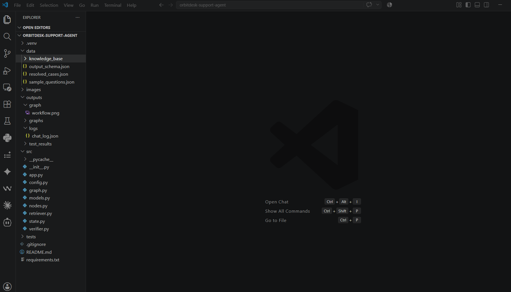
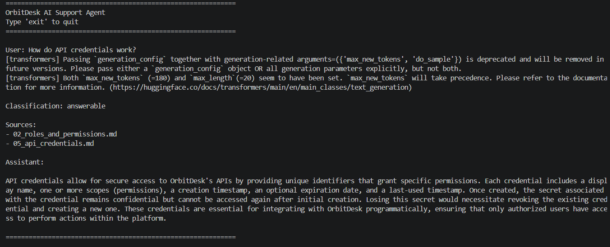
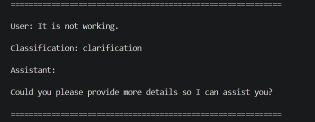
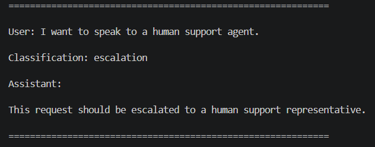
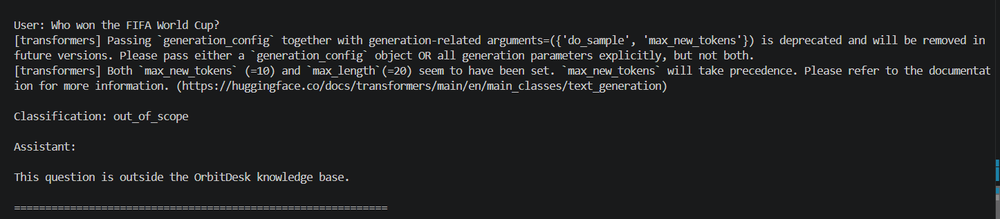
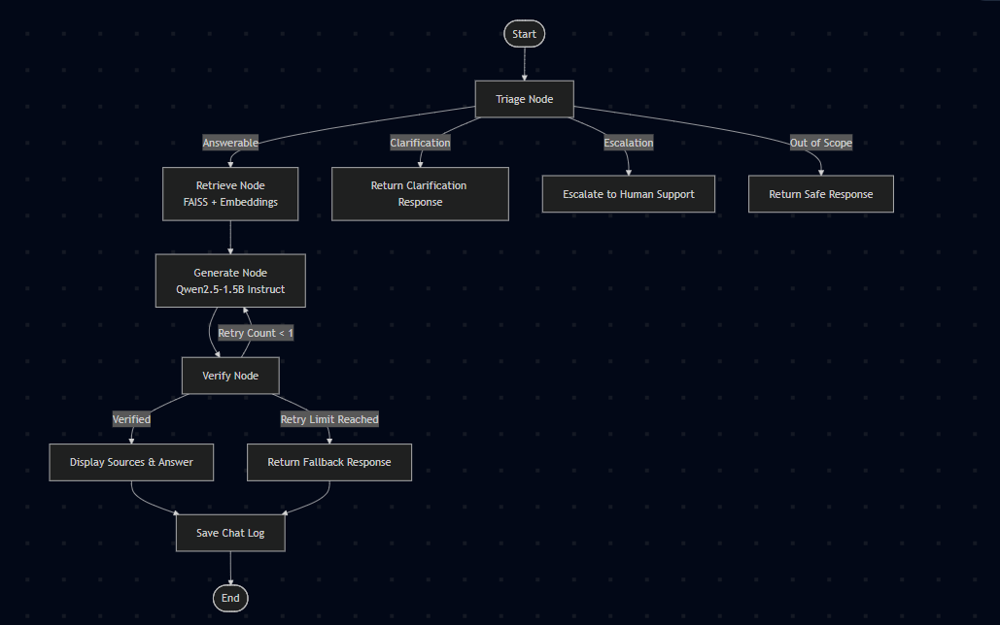
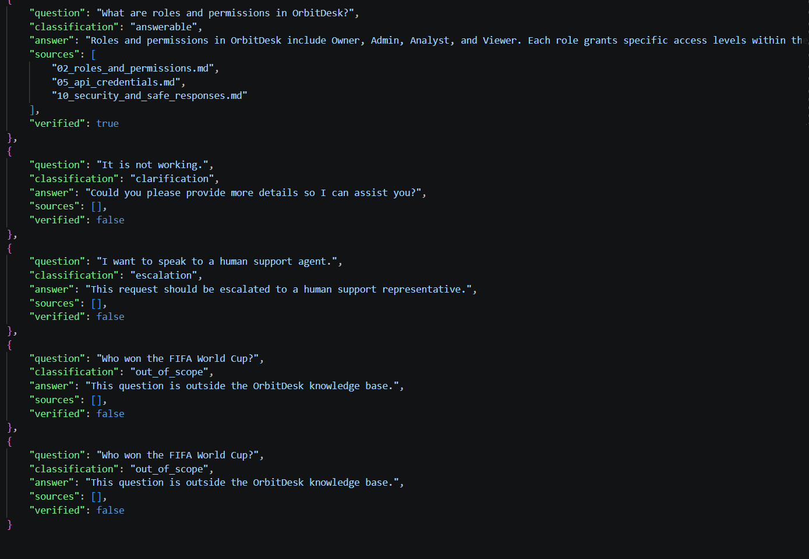
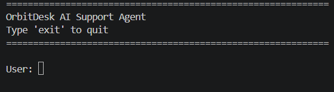

# OrbitDesk AI Support Agent

An AI-powered Retrieval-Augmented Generation (RAG) Support Assistant built using **LangGraph**, **FAISS**, **Sentence Transformers**, and **Hugging Face Transformers**.

The application answers OrbitDesk support questions by retrieving relevant information from a local knowledge base and generating responses using a locally running Large Language Model (LLM). It runs entirely on the local machine after the required models have been downloaded, without relying on hosted LLM APIs.

---

## Project Objective

The objective of this project is to build a graph-based AI support assistant capable of:

- Classifying incoming user requests
- Retrieving relevant knowledge base documents
- Generating context-aware answers
- Verifying generated responses
- Returning safe responses for unsupported queries
- Running completely on a local machine

---

## Features

- LangGraph workflow orchestration
- Local Hugging Face LLM inference
- Retrieval-Augmented Generation (RAG)
- FAISS vector similarity search
- Sentence Transformer embeddings
- Automatic request triage
- Source attribution
- Response verification
- Retry mechanism
- Conversation logging
- Workflow visualization

---

## Technologies Used

- Python 3.12
- LangGraph
- LangChain
- FAISS
- Hugging Face Transformers
- Sentence Transformers
- PyTorch

---

## Models Used

### Embedding Model

- sentence-transformers/all-MiniLM-L6-v2

Used to convert knowledge base documents and user queries into vector embeddings for semantic retrieval.

### Language Model

- Qwen/Qwen2.5-1.5B-Instruct

Used to generate answers from the retrieved context.

---

## Hardware Used

| Component | Specification |
|-----------|---------------|
| CPU | Qualcomm Snapdragon X |
| RAM | 16 GB |
| GPU | None (CPU-only inference) |
| Operating System | Windows 11 |

---

## Project Structure

```text
orbitdesk-support-agent/
│
├── data/
│   ├── knowledge_base/
│   ├── output_schema.json
│   ├── resolved_cases.json
│   └── sample_questions.json
│
├── images/
│
├── outputs/
│   ├── graph/
│   │   └── workflow.png
│   ├── logs/
│   └── test_results/
│
├── src/
│   ├── app.py
│   ├── config.py
│   ├── graph.py
│   ├── models.py
│   ├── nodes.py
│   ├── retriever.py
│   ├── state.py
│   └── verifier.py
│
├── README.md
├── requirements.txt
└── .gitignore
```

---

## Workflow


### Workflow Description

1. User submits a question.
2. The Triage Node classifies the request.
3. If answerable, relevant documents are retrieved using FAISS.
4. Retrieved context is passed to the local Qwen language model.
5. Generated response is verified.
6. If verification succeeds, sources and answer are displayed.
7. Otherwise, a fallback response is returned.
8. The conversation is saved to the chat log.

---

## Request Routing

The assistant classifies requests into four categories:

### Answerable

Questions that can be answered from the OrbitDesk knowledge base.

Example:

```
How do API credentials work?
```

---

### Clarification

Questions that are too vague.

Example:

```
It is not working.
```

---

### Escalation

Requests that require a human support representative.

Example:

```
I want to speak to a human support agent.
```

---

### Out of Scope

Questions unrelated to OrbitDesk.

Example:

```
Who won the FIFA World Cup?
```

---

## Installation

Clone the repository:

```bash
git clone https://github.com/sriram-257/orbitdesk-support-agent.git
cd orbitdesk-support-agent
```

Create a virtual environment:

```bash
python -m venv .venv
```

Activate the environment:

Windows

```bash
.venv\Scripts\activate
```

Install dependencies:

```bash
pip install -r requirements.txt
```

---

## Running the Project

```bash
python -m src.app
```

---

## Example Interaction

```
User:
How do API credentials work?

Classification:
answerable

Sources:
- 02_roles_and_permissions.md
- 05_api_credentials.md

Assistant:
API credentials allow secure access to OrbitDesk APIs by providing authenticated permissions...
```

---

## Screenshots

### Project Structure



### Answerable Query



### Clarification Query



### Escalation Query



### Out of Scope Query



### Workflow



### Chat Log



### Terminal Startup



---

## Logging

Every interaction is stored in:

```
outputs/logs/chat_log.json
```

Each entry records:

- User question
- Classification
- Generated answer
- Retrieved sources
- Verification status

---

## Design Decisions

- LangGraph was used to implement a modular workflow.
- FAISS enables efficient semantic document retrieval.
- Sentence Transformers generate embeddings for similarity search.
- Qwen2.5-1.5B-Instruct provides local response generation.
- Verification prevents unsupported responses from being presented as valid.
- Chat logs improve debugging and evaluation.

---

## Known Limitations

- Limited to the supplied OrbitDesk knowledge base.
- Responses depend on retrieval quality.
- CPU inference is slower than GPU inference.
- No graphical user interface in the current implementation.

---

## Future Improvements

- Streamlit or web-based interface
- Conversation memory
- Streaming responses
- Multi-user support
- Confidence scoring
- Improved response verification
- Larger language models

---

## AI Assistance Disclosure

AI coding tools were used to assist with code suggestions, debugging, documentation improvements, and development support. All implementation decisions, integration, testing, and final verification were completed by the project author.

---

## Author

**Koduru Sri Ram**

GitHub: https://github.com/sriram-257
email: sriramkoduru333@gmail.com

---

## License

This project is intended for educational purposes as part of the OrbitDesk AI Engineering Internship assignment.

