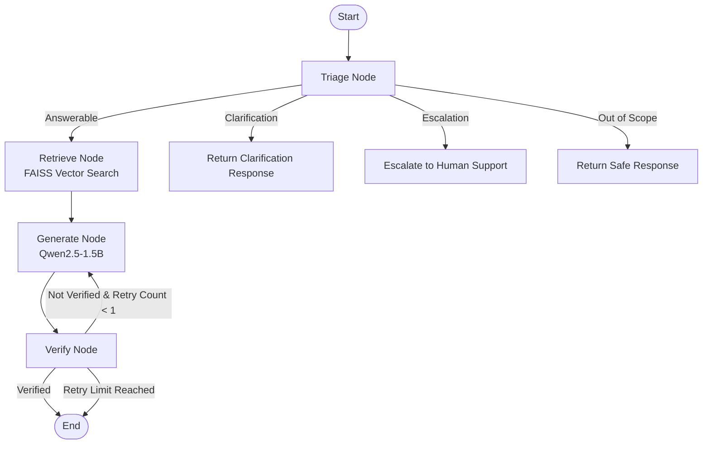

```mermaid
flowchart TD

    A([Start]) --> B[Triage Node]

    B -->|Answerable| C[Retrieve Node<br/>FAISS Vector Search]
    B -->|Clarification| D[Return Clarification Response]
    B -->|Escalation| E[Escalate to Human Support]
    B -->|Out of Scope| F[Return Safe Response]

    C --> G[Generate Node<br/>Qwen2.5-1.5B]

    G --> H[Verify Node]

    H -->|Verified| I([End])

    H -->|Not Verified & Retry Count < 1| G

    H -->|Retry Limit Reached| I
```